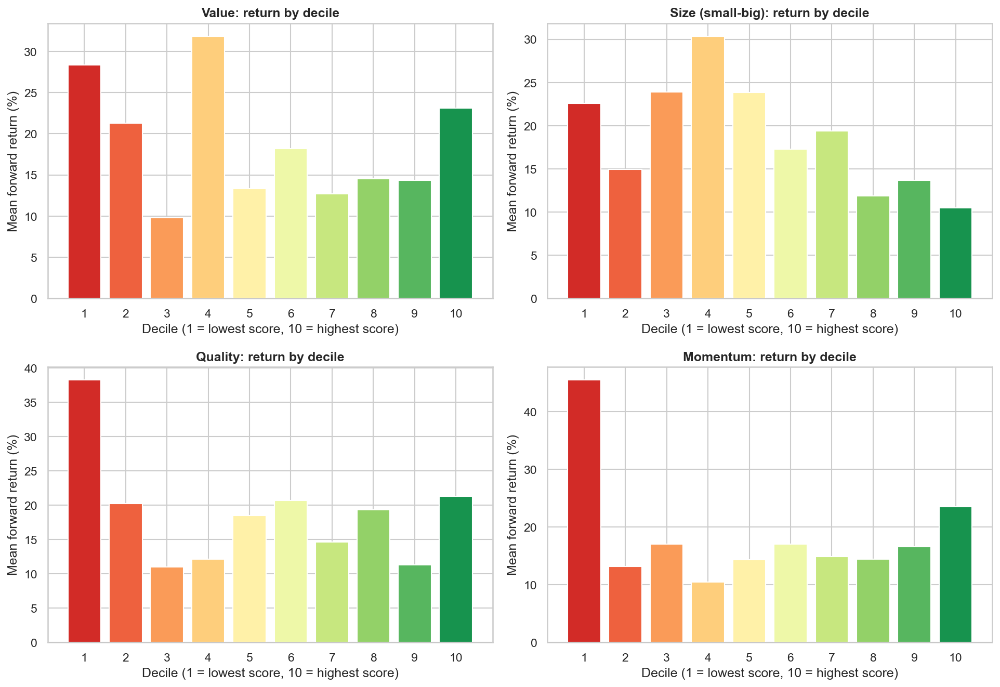
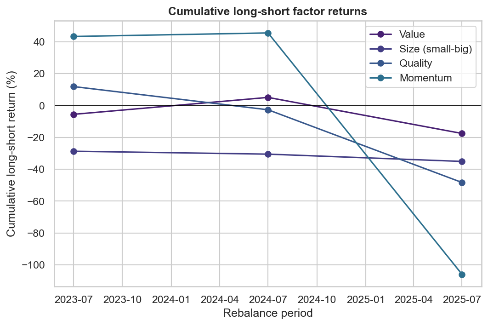
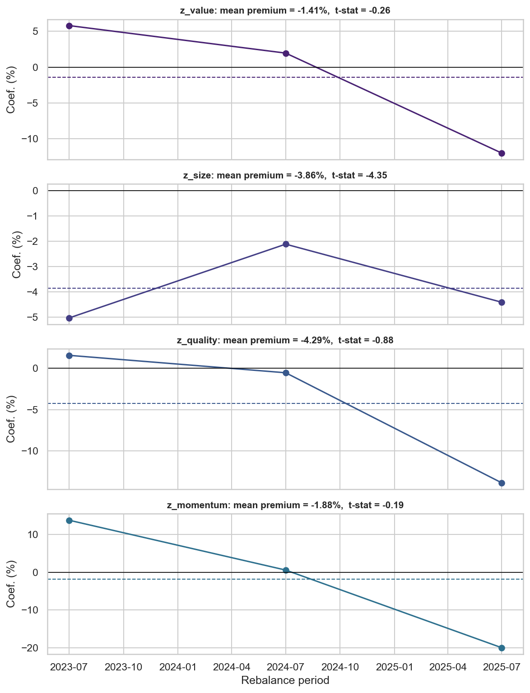
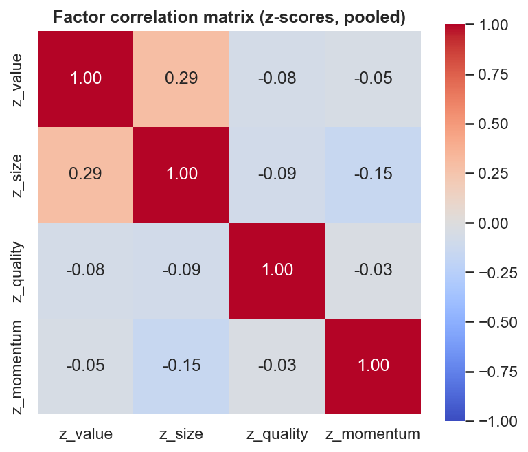
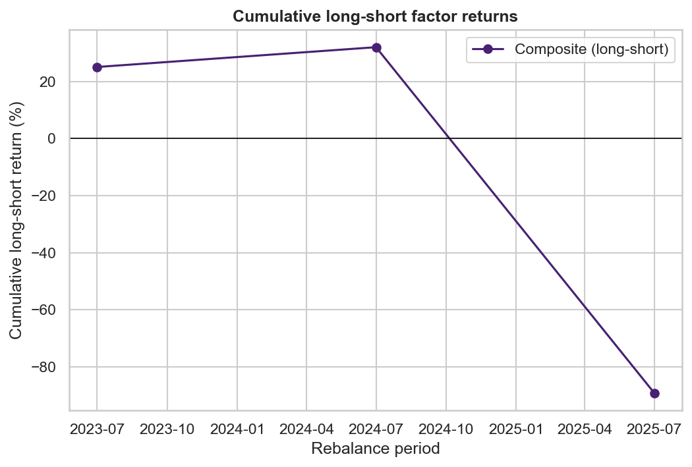

# Multi-Factor Equity Model

[](https://colab.research.google.com/github/YOUR-GITHUB-USERNAME/multi-factor-equity-model/blob/main/notebooks/multi_factor_equity_model.ipynb)

A cross-sectional, Fama-French-style factor investing model built on 192 US large/mid-cap equities. It constructs **value, momentum, size, and quality** factors, decile-sorts and long-short backtests each one independently, estimates factor risk premia with a two-pass **Fama-MacBeth (1973)** regression benchmarked against the **Kenneth French Data Library**, and combines the factors into a composite z-score portfolio decomposed back into its factor exposures.

> **TODO (repo owner):** replace `YOUR-GITHUB-USERNAME` in the badge URL above (and in the notebook's setup cell) once this is pushed to GitHub, so "Open in Colab" resolves to the real repo.

## Why this exists

Cross-sectional factor investing — sorting a universe of stocks each period on characteristics like valuation, momentum, size, and profitability, then going long the attractive end and short the unattractive end — is the empirical backbone of both academic asset pricing (Fama-French, Carhart) and a large share of systematic equity investing in practice (AQR, Dimensional Fund Advisors, and most quantitative equity desks build on some version of this framework). This project reimplements the core pipeline end-to-end — data acquisition, factor construction, portfolio formation, and risk premium estimation — as a portfolio piece demonstrating that workflow on real market data, not canned/pre-cleaned datasets.

## What's in here

```
multi-factor-equity-model/
  notebooks/multi_factor_equity_model.ipynb   primary deliverable — runs top to bottom, no manual edits
  src/
    data.py         FMP + yfinance pulls, caching, universe assembly, point-in-time hygiene
    factors.py       value, momentum, size, quality construction + cross-sectional z-scoring
    portfolios.py    decile sorts, long-short spreads, composite score, backtest, performance stats
    regression.py     Fama-MacBeth two-pass regression + Kenneth French benchmark comparison
    viz.py           all plotting functions
  data/
    universe.csv     static ~190-ticker universe (sector-labeled)
    sample/          small cached sample for reproducibility without an API key
    raw/             gitignored — full cached pulls, regenerated on first run
  requirements.txt
  LICENSE (MIT)
```

## Methodology summary

**Universe.** 192 US large/mid-cap equities across 10 GICS sectors, hand-picked as a static snapshot (`data/universe.csv`) — not a point-in-time historical index membership list. See [Limitations](#limitations) for what that implies.

**Data.** Fundamentals come from Financial Modeling Prep (FMP), annual frequency, with a yfinance-derived fallback for any ticker FMP's free tier won't serve (see [Limitations](#limitations) — this ended up being most of the universe). Prices come from yfinance: full daily history, no API key required, used for momentum and forward returns.

**Point-in-time hygiene.**
- *No lookahead*: every fundamental row is stamped `available_date = fiscal_period_end + 90 days`, a conservative pad past the ~60-75 day 10-K filing deadline large caps typically meet (FMP's free tier doesn't expose exact filing dates). Rebalance dates are fixed at **July 1 of the year after** each fiscal year — guaranteed to fall after `available_date` for every ticker regardless of individual fiscal calendars, and checked programmatically (`factors.assign_rebalance_period` drops any row that would violate it). Momentum and forward returns are read directly off the price panel at those same rebalance dates.
- *No survivorship bias within the universe*: no ticker is dropped for having a bad period — every name with fundamentals data for a period is scored in that period's cross-section, good or bad. (The universe itself is still a today-snapshot; see Limitations.)

**Factors** (each z-scored cross-sectionally within period, after winsorizing at the 1st/99th percentile):
| Factor | Construction |
|---|---|
| Value | average z-score of book-to-market (1/P·B) and earnings yield |
| Size | −log(market cap) — long small, short large, standard SMB convention |
| Quality | average z-score of ROE and (negative) expanding-window net-margin volatility |
| Momentum | 12-1 month prior return (skips the most recent month to avoid short-term reversal) |

**Portfolios.** Independent decile sorts per factor per period; long-short spread = equal-weighted decile 10 minus decile 1. A composite z-score (equal-weighted average of the four factor z-scores) drives a fifth long-short portfolio, which is then decomposed by regressing its returns on the four single-factor spreads.

**Fama-MacBeth.** Pass 1 runs one cross-sectional OLS per rebalance period (`forward return ~ factor z-scores`). Pass 2 averages each factor's coefficient over time and computes a t-stat on that mean — the standard construction. Results are compared against Kenneth French's public data library (HML, SMB, RMW, Mom), pulled live and restricted to the *same sample years* our data covers, not French's full history.

## How to run

### Colab (one click)
Click the "Open in Colab" badge above. The first cell clones this repo and installs dependencies; a later cell prompts for your FMP API key (or reads it from Colab's Secrets manager if you've added it there under the name `FMP_API_KEY`). Run all cells top to bottom.

### Locally
```bash
git clone https://github.com/YOUR-GITHUB-USERNAME/multi-factor-equity-model.git
cd multi-factor-equity-model
pip install -r requirements.txt
export FMP_API_KEY=your_key_here   # https://site.financialmodelingprep.com — free tier works
jupyter notebook notebooks/multi_factor_equity_model.ipynb
```
Run all cells top to bottom. Everything pulled from FMP/yfinance is cached to `data/raw/` (gitignored), so a second run is instant.

## Key results

_(from the most recent full run against live data — see the notebook for the complete output)_

The live pull covered fiscal years 2021-2026, yielding **4 usable annual rebalance cross-sections** (2023, 2024, 2025, 2026) and **3 realized forward-return periods** after the July-2026 snapshot (which has factor scores but no forward return yet, since that year hasn't happened). That's a small sample — see [Limitations](#limitations) — but three results stand out as informative anyway:

**1. All four factor premia have the same sign as Kenneth French's realized benchmark returns over the identical sample years**, despite being built from a completely different (smaller, US-only, equal-weighted) universe:

| Factor | Our mean premium | Our t-stat | French benchmark | French mean return (same years) | Same sign? |
|---|---:|---:|---|---:|:---:|
| Value | −1.41% | −0.26 | HML | −4.39% | ✅ |
| Size | −3.86% | **−4.35** | SMB | −9.76% | ✅ |
| Quality | −4.29% | −0.88 | RMW | −0.01% | ✅ |
| Momentum | −1.88% | −0.19 | Mom | −2.19% | ✅ |

2023-2026 was a large-cap-, quality-, and momentum-unfriendly stretch in both our data and French's — all four premia came in negative, and our size premium's t-stat of −4.35 is the one estimate here with real statistical bite (small caps underperformed large caps sharply in both datasets over this window).

**2. The four factors are close to uncorrelated** (pooled z-scores across all 753 observations): the highest pairwise correlation is value-size at 0.29; quality and momentum are both under 0.15 in absolute correlation with everything else. That's exactly the diversification a multi-factor composite is supposed to capture.

**3. A real momentum crash shows up in the data.** Stocks that were momentum *losers* as of July 2025 — Micron, Intel, AMD, Applied Materials among them — went on to massively outperform by July 2026 (Micron alone: a 12-month forward return over 750%, confirmed against the underlying daily price series, not a data artifact), driving the momentum long-short spread to roughly −104% in a single period and dragging the composite portfolio's cumulative return deeply negative. This is a textbook momentum-crash episode (Daniel & Moskowitz, 2016: momentum's worst drawdowns come right after sharp reversals in previously-beaten-down names), not a bug — but it's also a single-period, small-universe event that shouldn't be over-interpreted.







## Limitations

Being upfront about these matters more than pretending they don't exist:

- **Universe size and survivorship bias.** The ~190-ticker universe is a static, present-day snapshot applied retroactively across the whole backtest window — not point-in-time historical index membership. Companies removed from major indices for underperforming, or that went bankrupt, are absent, which biases results upward. Fixing this properly requires point-in-time constituent data (e.g., CRSP), which isn't available on a free-tier budget.
- **FMP free-tier symbol coverage.** Probing this project's FMP API key against ~200 candidate tickers before finalizing the design showed the free tier whitelists only a minority of symbols (mostly the largest, most-traded names) for the `key-metrics`/`ratios` endpoints — everything else returns HTTP 402. A 100+ name cross-sectional study isn't possible on FMP alone at this subscription tier, so fundamentals are sourced FMP-first with a **yfinance-derived fallback** for every other ticker (reconstructed from raw income statement + balance sheet + our own price panel). Each row in the fundamentals panel carries a `source` column so this is visible in the data. In the run this repo ships with, sustained API testing during development also triggered FMP's rate limit partway through the live pull, pushing even more tickers onto the yfinance fallback than would happen on a fresh key — rerun the notebook with a fresh/rested key for a larger FMP-sourced share.
- **Annual, not quarterly, rebalancing.** FMP's free tier caps fundamentals history at a handful of periods and doesn't expose filing dates, so this project rebalances annually rather than quarterly, yielding on the order of **3-4 realized forward-return periods** in the current pull. That is enough to demonstrate the full methodology end-to-end, but it is **not enough data for statistically powerful Fama-MacBeth t-stats or a reliable composite-portfolio factor decomposition** — with 4 factors plus an intercept and only ~3 usable periods, the decomposition regression is underdetermined (the notebook prints an explicit warning when this happens). Treat the point estimates as illustrative of the method, not as a claim about real-world factor premia.
- **90-day filing lag is an assumption, not observed data.** Neither FMP's free tier nor the yfinance fallback expose exact SEC filing dates, so point-in-time availability is approximated with a fixed, conservative 90-day pad after each fiscal period end rather than each company's actual filing date.
- **Extreme single-period spreads.** With only ~18-19 names per decile, one outlier can swing an equal-weighted decile average sharply — the live pull includes a real episode where semiconductor names that were momentum "losers" at one rebalance date (e.g. Micron, Intel, AMD) went on to massively outperform by the next one, a textbook momentum crash rather than a data error (verified against the underlying daily price series). Long-short *spreads* are also not bounded at −100% the way a single long position is, which can break naive geometric compounding in a single extreme period — handled explicitly in `portfolios.performance_stats`, documented in its docstring.
- **Equal weighting throughout.** Decile portfolios and the composite portfolio are equal-weighted, not value-weighted, for simplicity — a standard simplification, but it means results aren't directly comparable to value-weighted benchmarks like the ones published in the Kenneth French library without adjustment.
- **No transaction costs, no turnover analysis.** This is a gross-of-cost, paper backtest.
